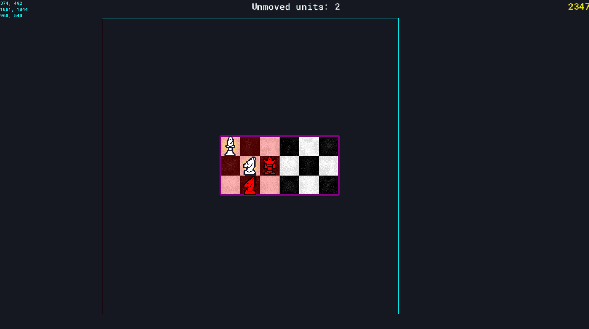
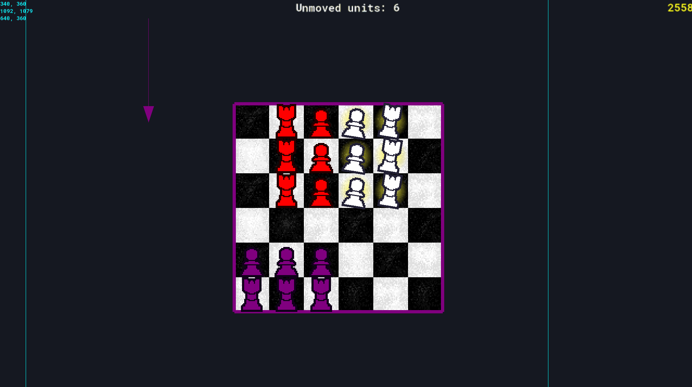

# ChessField
 A game inspired by Chess and Fire Emblem.

 The game is played on an ever-changeing chess board that is made up of 3x3 modules, where each turn the player and AI opponents can move every unit they own.

__The game currently features__:
- A grid system that stores tile properties, like the color and what kind of unit it has on it.
- All the units that are available in chess, with similar movements.
- Player units(white) that can move are animated to grab the attention of the player.
- On selecting a unit, yellow squares are drawn on the board showing where the selected unit can move to, or which enemy units can it take down.
- There are sounds that play when the player picks up a unit, places down a unit, and a sound for every other type of incorrect move.
- The game features a very simple enemy AI that feels like a real player.
- A simple turn order is implemented, so that the player and 2 AI opponents take turn fighting agains each other.
- Modular chess board that "falls down" or "rises from above" simulating an ever changing battlefield of units, as with every new module that comes up randomly selected units are created on them.
- Simple shader dissolve shader for unit destruction.

Download the game at [Releases](https://github.com/UltraMKF12/ChessField/releases), or played in the browser at [itch.io](https://ultramkf12.itch.io/chessfield)

__Planned features__:
- Start, Options and Play menu.
- The player will gain gold on each defeat(King captured).
- On every new game, the player build their army from zero, every unit has gold cost to place.
- New units that have chesslike aesthetics, ex: Rifeleman unit that doesn't need to move to take out other units.

# Controls:
- WASD - Move the camera
- Left Mouse Button - HOLD to select and drag a unit to a location, RELEASE to place unit.
- ScrollWheel - Zoom

__Debug, Cheats__:
- Right Mouse Button - Place or remove a module on mouse position
- 1-6 number keys - Place a specific unit on mouse position
- ALT button - Change the current team(Player, Enemy1, Enemy2) the current unit being placed is.
- CONTROL button - Delete unit at mouse position.
- F button - Fullscreen toggle
- R button - Restart game
- ESC button - Quit game

